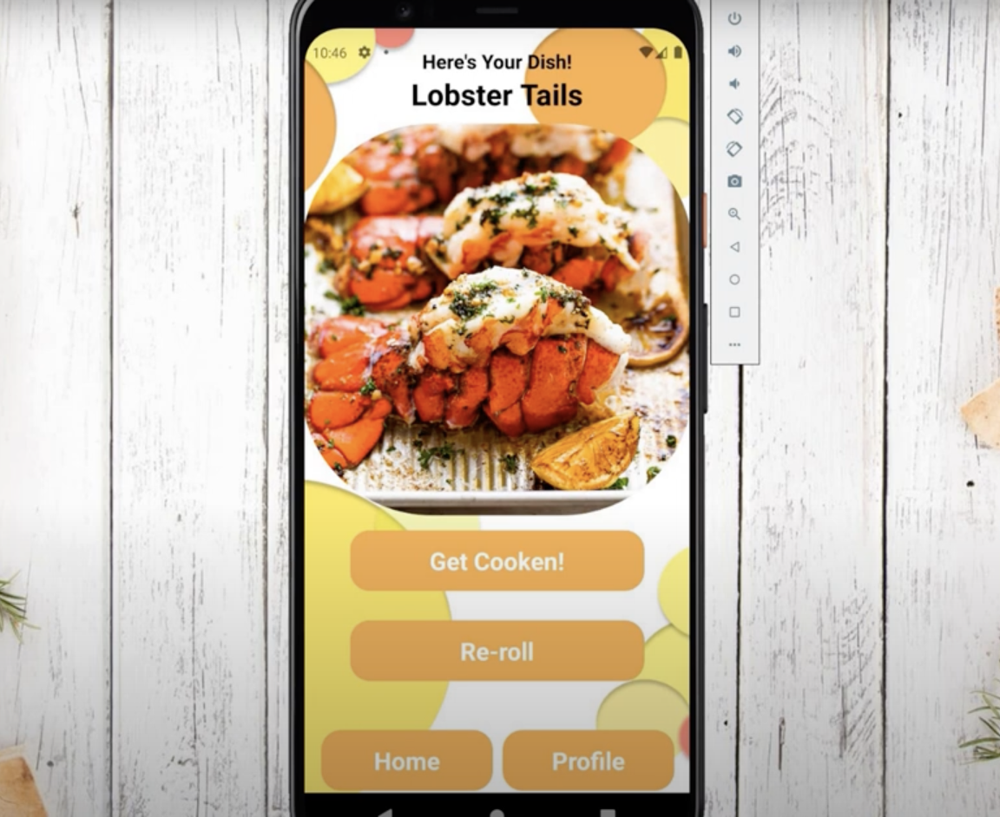

# Cooken

Cooken is a mobile application taking the indecision out of choosing meals. Easily add, save, and categorize your favorite recipes. And for extra fun, the 'surprise me!' button will generate a random recipe based on your preferences. Upcoming features include scheduling out a week's worth of meals.



## Tech Stack
### Frontend
- React Native with Expo
- Typescript
- CSS
### Backend
- Node.js with Express.js for the Server
- JWT for authentication
- MongoDB and Mongoose as the Database

## Getting Started
- Choose an emulator: We used Expo Go
- Download and setup Expo (or other emulator) on your phone
### Client
- Change directory into client folder
- To install dependencies, run:
```npm install```
- After dependencies have been installed, start the client:
```npm start```
- If you've chosen Expo, take a picture of the QR code with your phone and click the link
- This should automatically load the app on your phone
### Server
- Change directory into server folder
- Following the example in .env.example, add your credentials to your .env file
- To install the backend dependencies, run:
```npm install```
- Start the server:
```nodemon```
### Database
- Choose your ODM - we used MongoDB Compass
- Setup your account and add your credentials to the .env file

## API Endpoints

| API                              | Method  | Endpoint                 |  Status |
| :------------------------------  | :------ | :----------------------- | ------: |
| 🙋‍♀️ Users                         |
| Register New User                | POST    | /register                      |     201 |
| User Login                       | POST    | /login                         |     200 |
| Get User Profile                  | GET     | /profile                        |     200 |
| Logout                           | POST    | /logout                        |     204 |
| 📝 Recipes                       |
| Get Random Recipe                | GET     | /recipe                        |     201 |
| Get Recipe Based On Preference   | GET     | /recipe/:cuisineTag/:difficulty |     200 |

  
Created and built by [Mike Kaib](https://github.com/mkcannon) - Full Stack Developer and [Ash Mudra](https://github.com/AshMudra) - Full Stack Developer
